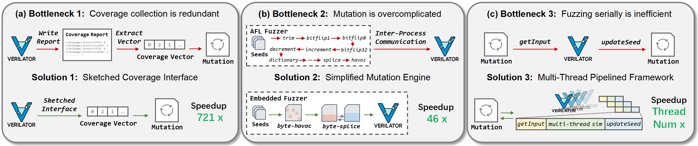

# Faster Hardware Fuzzing Framework

## Introduction

This is the source code of our submission *"Faster Hardware Fuzzing for Practical IC Verification Workflow"* for DATE 2025.



Our framework **FastHwFuzz** is built upon RTL Fuzz Lab and JQF. We have solved the above speed bottlenecks in hardware fuzzing and achieved a speedup of hundreds of times compared with RTL Fuzz Lab. 

## Installation

The following dependencies are required to run this software:
* make
* gcc, g++
* java, sbt
* verilator
* matplotlib, scipy

To run our FastHwFuzz:

Firstly, our modified chiseltest should be packaged and published locally.
```.sh
cd chiseltest
sbt
publishLocal
exit
```
Secondly, verilator is also modified and need to be compiled.
```.sh
cd verilator
autoconf
export VERILATOR_ROOT=`pwd`
./configure
make
```
Then we can run FastHwFuzz through scripts provided.
```.sh
bash run.sh
```

